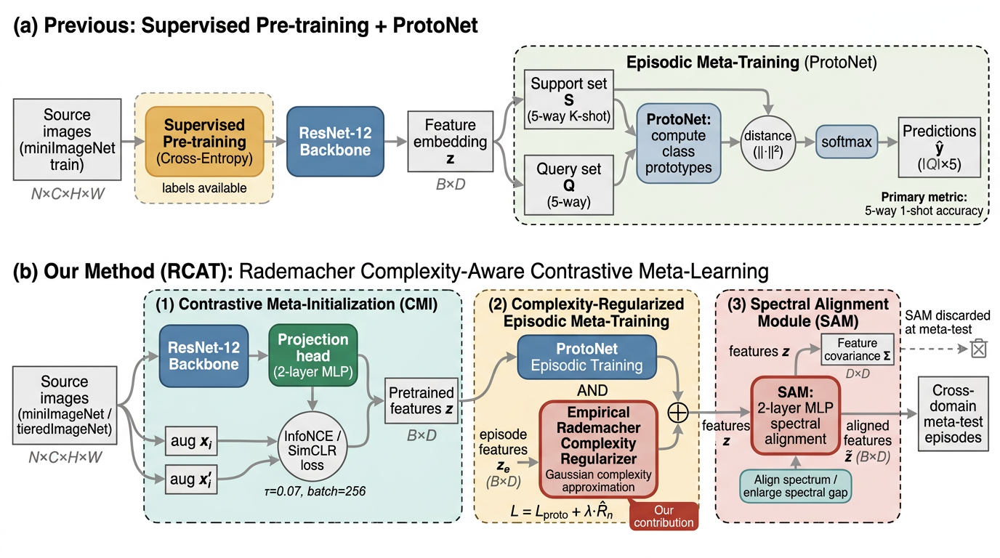
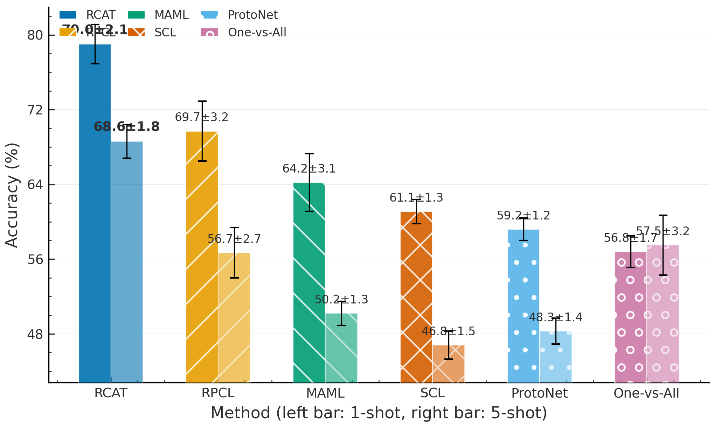
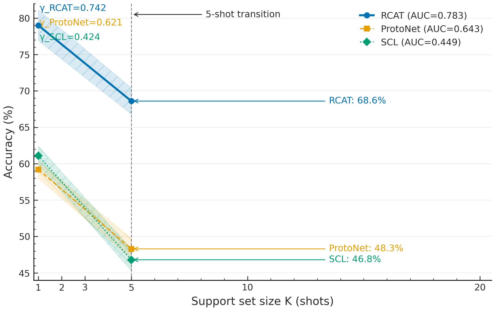
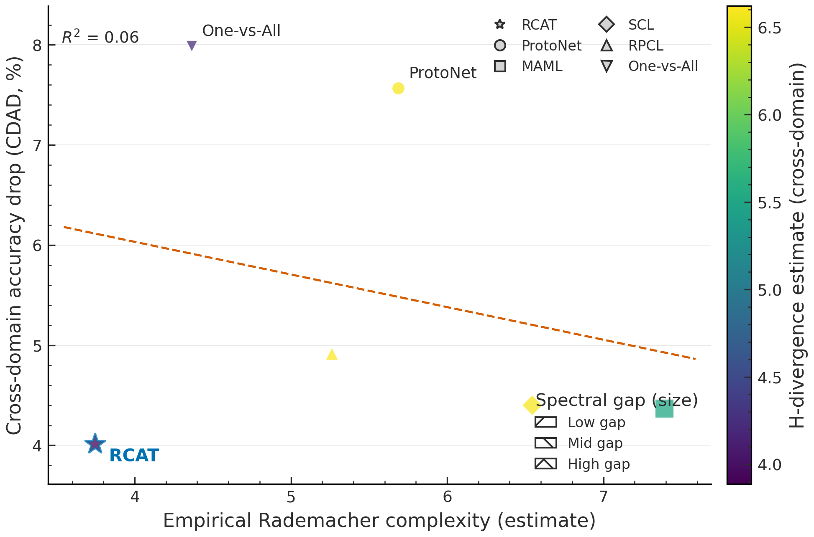

<div align="center">
  

# NanoResearch

**An AI research engine for going from topic → experiments → figures → paper draft.**

Built for **grounded autonomous research**: NanoResearch turns a topic into literature-grounded plans, runnable experiment code, execution artifacts, figures, and a compiled LaTeX paper inside a resumable workspace.

<p>
  <a href="#quick-start"><b>Quick Start</b></a> ·
  <a href="#showcase"><b>Showcase</b></a> ·
  <a href="#pipeline"><b>Pipeline</b></a>
</p>

<p>
  <a href="https://github.com/OpenRaiser/NanoStudy-dev"></a>
  
  
  
  
</p>

<p>
  <a href="https://github.com/OpenRaiser/NanoStudy-dev">GitHub Repository</a>
</p>
</div>

---

## Table of contents

- [Overview](#overview)
- [Why NanoResearch](#why-nanoresearch)
- [Use cases](#use-cases)
- [Showcase](#showcase)
- [Pipeline](#pipeline)
- [Key capabilities](#key-capabilities)
- [How it works](#how-it-works)
- [Quick start](#quick-start)
- [Execution profiles](#execution-profiles)
- [Common CLI commands](#common-cli-commands)
- [Output structure](#output-structure)
- [Model routing](#model-routing)
- [Paper formats](#paper-formats)
- [Project structure](#project-structure)
- [Requirements](#requirements)
- [Testing](#testing)
- [Notes](#notes)
- [FAQ](#faq)
- [Roadmap](#roadmap)
- [Citation](#citation)
- [License](#license)

## Overview

NanoResearch is a unified research pipeline that automates the full paper-production workflow:

- 🔎 starts from a research topic
- 📚 searches and synthesizes relevant literature
- 🧪 proposes an experiment blueprint
- 💻 generates runnable code and scripts
- ⚙️ executes locally or on SLURM
- 📈 analyzes real outputs
- 🖼️ generates figures
- ✍️ writes a LaTeX paper draft
- 🧠 reviews and revises the result

It is designed around **resumable workspaces**, **multi-model routing**, and **grounded writing** so that downstream paper content is tied to actual experiment evidence instead of free-form draft generation.

## Why NanoResearch

Most "AI paper writers" stop at outlines or prose. NanoResearch is built for a deeper loop:

- **End-to-end pipeline**: topic to exportable paper workspace
- **Grounded writing**: writing consumes structured experiment evidence, figures, and citations
- **Checkpoint + resume**: failed stages can be resumed from the last saved state
- **Execution-aware**: supports local execution and SLURM-backed workflows
- **Multi-model by stage**: route ideation, coding, writing, and review to different models
- **Exportable outputs**: clean paper/code/figure bundles for sharing or submission prep

## Use cases

- 🚀 **Research prototyping** — quickly turn a fresh idea into a full experiment-and-paper workspace
- 🧪 **Benchmark generation** — create repeatable topic-to-paper runs across multiple tasks
- 🤖 **Autonomous experimentation** — let the system generate code, execute runs, and analyze outputs
- 📝 **Paper drafting from evidence** — produce LaTeX drafts grounded in actual experiment artifacts
- 🗂️ **Internal research tooling** — use workspaces, manifests, and stage artifacts as an auditable research log

## Showcase

### Generated research workspace

A typical NanoResearch run produces a clean, inspectable workspace containing:

- literature and planning artifacts
- runnable experiment code
- generated figures
- LaTeX paper sources and bibliography
- a final exported bundle for sharing or submission prep

### Example outputs

<table>
  <tr>
    <td align="center" width="50%">
      
      <br />
      <sub><b>Framework</b></sub>
    </td>
    <td align="center" width="50%">
      
      <br />
      <sub><b>Main Results</b></sub>
    </td>
  </tr>
</table>

<table>
  <tr>
    <td align="center" width="50%">
      
      <br />
      <sub><b>Sample Complexity</b></sub>
    </td>
    <td align="center" width="50%">
      
      <br />
      <sub><b>Theory Analysis</b></sub>
    </td>
  </tr>
</table>

### What the pipeline saves

Typical saved artifacts include:

- 📋 `manifest.json` for stage state and artifact tracking
- 📚 `papers/` and `plans/` for literature and experiment context
- 💻 `code/` for runnable experiment projects
- 🖼️ `figures/` for generated visuals
- 📄 exported paper assets such as `paper.tex`, `references.bib`, and `paper.pdf`

## Pipeline

```text
Topic
  ↓
IDEATION → PLANNING → SETUP → CODING → EXECUTION → ANALYSIS → FIGURE_GEN → WRITING → REVIEW
  ↓
Exported workspace with paper.pdf / paper.tex / references.bib / figures / code / data
```

`nanoresearch run` uses the **unified deep backbone** by default.
The `deep` command is kept as a compatibility alias, and the legacy standard orchestrator remains available for older workspaces.

### Stage summary

| Stage | What it does |
| --- | --- |
| `IDEATION` | Search literature, identify gaps, propose hypotheses, collect must-cite candidates |
| `PLANNING` | Turn the idea into a concrete experiment blueprint |
| `SETUP` | Prepare repositories, dependencies, models, and datasets |
| `CODING` | Generate a runnable experiment project |
| `EXECUTION` | Run experiments locally or on SLURM, with retry/debug support |
| `ANALYSIS` | Parse logs and metrics into structured evidence |
| `FIGURE_GEN` | Create architecture visuals and result charts |
| `WRITING` | Write and compile the LaTeX paper draft |
| `REVIEW` | Review sections, detect issues, and revise |

## Key capabilities

| Capability | What it means in practice |
| --- | --- |
| **Grounded writing** | Paper sections are written from structured evidence, citations, and experiment artifacts instead of pure free-form generation |
| **Resumable workspaces** | Each stage writes artifacts to disk so failed runs can be resumed instead of restarted |
| **Execution-aware pipeline** | Generated code can be executed locally or on SLURM-backed environments |
| **Multi-model routing** | Different stages can use different models for ideation, coding, writing, figures, and review |
| **Exportable outputs** | Final outputs can be exported as a clean bundle with paper, figures, code, data, and manifest |

### Literature + citation grounding
- Searches external research sources and builds structured ideation artifacts
- Tracks must-cite papers and citation quality through the writing pipeline
- Produces BibTeX-backed LaTeX drafts instead of plain-text summaries

### Real experiment evidence
- Writing and figures consume execution outputs and analysis artifacts
- Helps keep tables, claims, and plots tied to actual results
- Preserves intermediate JSON artifacts for debugging and auditability

### Hybrid figure generation
- Architecture figures can be image-model driven
- Results and ablation figures can be generated from code
- Figure prompts, scripts, and outputs are saved into the workspace

### Workspace-first workflow
Every run gets its own workspace under:

```text
~/.nanobot/workspace/research/{session_id}
```

That workspace stores the manifest, stage artifacts, logs, generated code, paper drafts, and exported outputs.

## How it works

```text
1. IDEATION   → collect papers, gaps, hypotheses, must-cite candidates
2. PLANNING   → build the experiment blueprint
3. SETUP      → prepare repos, environments, and resources
4. CODING     → generate runnable experiment code
5. EXECUTION  → run locally or on SLURM
6. ANALYSIS   → convert outputs into structured evidence
7. FIGURE_GEN → generate architecture and results figures
8. WRITING    → build paper.tex, references.bib, and paper.pdf
9. REVIEW     → critique and revise the draft
```

The result is not just a document. It is a full research workspace with saved intermediate state, artifacts, and logs that can be resumed and inspected later.

## Quick start

### 1) Install

```bash
git clone https://github.com/OpenRaiser/NanoStudy-dev.git
cd NanoStudy-dev
pip install -e ".[dev]"
```

### 2) Configure

Create `~/.nanobot/config.json`:

```json
{
  "research": {
    "base_url": "https://your-openai-compatible-endpoint/v1/",
    "api_key": "your-api-key",
    "template_format": "neurips2025",
    "execution_profile": "local_quick",
    "writing_mode": "hybrid",
    "max_retries": 2,
    "auto_create_env": true,
    "auto_download_resources": true,
    "ideation": {
      "model": "deepseek-ai/DeepSeek-V3.2",
      "temperature": 0.5,
      "max_tokens": 16384,
      "timeout": 600.0
    },
    "planning": {
      "model": "deepseek-ai/DeepSeek-V3.2",
      "temperature": 0.2,
      "max_tokens": 16384,
      "timeout": 600.0
    },
    "code_gen": {
      "model": "gpt-5.2-codex",
      "temperature": null,
      "max_tokens": 16384,
      "timeout": 600.0
    },
    "writing": {
      "model": "deepseek-ai/DeepSeek-V3.2",
      "temperature": 0.4,
      "max_tokens": 16384,
      "timeout": 600.0
    },
    "figure_gen": {
      "model": "gemini-3.1-flash-preview-image-generation",
      "image_backend": "gemini",
      "temperature": null,
      "timeout": 300.0
    },
    "review": {
      "model": "gemini-3.1-flash-lite-preview",
      "temperature": 0.3,
      "max_tokens": 16384,
      "timeout": 300.0
    }
  }
}
```

Environment-variable overrides are also supported:

- `NANORESEARCH_BASE_URL`
- `NANORESEARCH_API_KEY`
- `NANORESEARCH_TIMEOUT`

### 3) Validate config

```bash
nanoresearch run --topic "Adaptive Sparse Attention Mechanisms" --dry-run
```

### 4) Run the full pipeline

```bash
nanoresearch run --topic "Adaptive Sparse Attention Mechanisms" --format neurips2025 --verbose
```

### 5) Resume if a stage fails

```bash
nanoresearch resume --workspace ~/.nanobot/workspace/research/{session_id} --verbose
```

### 6) Export a clean output folder

```bash
nanoresearch export --workspace ~/.nanobot/workspace/research/{session_id} --output ./my_paper
```

## Execution profiles

The unified pipeline supports three high-level execution profiles:

| Profile | Behavior |
| --- | --- |
| `fast_draft` | Lightweight drafting and faster iteration |
| `local_quick` | Prefer local execution; can upgrade to SLURM when appropriate |
| `cluster_full` | Cluster-first execution for heavier runs |

## Common CLI commands

| Command | Purpose |
| --- | --- |
| `nanoresearch run --topic "..."` | Start a new unified pipeline run |
| `nanoresearch resume --workspace ...` | Resume from the last checkpoint |
| `nanoresearch status --workspace ...` | Show per-stage status and artifacts |
| `nanoresearch list` | List saved research sessions |
| `nanoresearch export --workspace ...` | Export a clean output bundle |
| `nanoresearch config` | Print the effective config with masked secrets |
| `nanoresearch inspect --workspace ...` | Inspect saved artifacts for a workspace |
| `nanoresearch health` | Run environment/config health checks |
| `nanoresearch delete <session_id>` | Remove a saved session workspace |

For the full command surface, use:

```bash
nanoresearch --help
```

## Output structure

A typical exported output looks like this:

```text
my_paper/
├── paper.pdf
├── paper.tex
├── references.bib
├── figures/
├── code/
├── data/
└── manifest.json
```

A live workspace contains the full intermediate state as well:

```text
~/.nanobot/workspace/research/{session_id}/
├── manifest.json
├── papers/
├── plans/
├── code/
├── figures/
├── drafts/
├── logs/
└── ...
```

## Model routing

NanoResearch routes different stages to different model configs through a single configuration layer.
This lets you mix models by task instead of forcing one model to do everything.

Typical routing buckets include:

- `ideation`
- `planning`
- `experiment`
- `code_gen`
- `writing`
- `figure_prompt`
- `figure_code`
- `figure_gen`
- `review`
- `revision`

The system is built around **OpenAI-compatible endpoints**, with support for stage-specific overrides when needed.

## Paper formats

Template formats are auto-discovered from `nanoresearch/templates/`.
Current built-in formats include:

- `arxiv`
- `icml`
- `neurips`
- `neurips2025`

Example:

```bash
nanoresearch run --topic "Graph Foundation Models for Biology" --format neurips2025
```

## Project structure

```text
nanoresearch/
├── nanoresearch/
│   ├── cli.py
│   ├── config.py
│   ├── agents/
│   ├── pipeline/
│   ├── schemas/
│   └── templates/
├── mcp_server/
├── skills/
├── tests/
├── outputs/
├── PROJECT_DOCUMENTATION.md
└── pyproject.toml
```

### Important modules

- `nanoresearch/agents/` — stage agents for ideation, planning, setup, coding, execution, analysis, figures, writing, and review
- `nanoresearch/pipeline/` — orchestrators, state machine, multi-model dispatch, and workspace management
- `nanoresearch/templates/` — LaTeX templates and conference formats
- `mcp_server/` — tool server integrations for research and document workflows
- `tests/` — regression and pipeline tests

## Requirements

- Python **3.10+**
- An **OpenAI-compatible API endpoint** for text-model stages
- Optional image-model access for some figure-generation setups
- `tectonic` or `pdflatex` for PDF compilation

Recommended LaTeX toolchain:

```bash
conda install -c conda-forge tectonic
```

## Testing

```bash
pip install -e ".[dev]"
pytest tests/ -v
```

## Notes

- This project is best suited to users comfortable with generated code, experiment debugging, and iterative research workflows.
- Generated papers still require human review before submission.
- The repository includes both the current unified pipeline and compatibility paths for older workspaces.

## FAQ

### Does NanoResearch run real experiments?
Yes. The pipeline is designed to generate runnable code, execute it locally or on SLURM, and feed resulting artifacts into later analysis, figure generation, and writing stages.

### Can I resume a failed run?
Yes. Workspaces are checkpointed by stage, and `nanoresearch resume --workspace ...` continues from the last incomplete or failed stage.

### Do I need one model for every stage?
No. NanoResearch supports per-stage model routing, so ideation, coding, writing, figures, and review can use different models.

### Is the generated paper submission-ready?
Treat it as a strong draft, not a final submission. The system can generate a full paper workspace and compiled draft, but human review is still required.

## Roadmap

- Improve README assets and example galleries
- Expand evaluation and benchmark coverage for autonomous research workflows
- Continue tightening grounding and citation-integrity guarantees
- Improve execution robustness across more local and cluster environments
- Refine figure generation and review-stage quality controls

## Citation

If NanoResearch helps your work, cite the repository:

```bibtex
@software{nanoresearch2026,
  title = {NanoResearch},
  author = {OpenRaiser},
  year = {2026},
  url = {https://github.com/OpenRaiser/NanoStudy-dev}
}
```

## License

MIT
